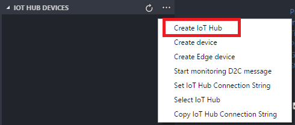

# Deploy Azure IoT Edge on a simulated device with VS Code

Azure IoT Edge enables you to perform analytics and data processing on your devices, instead of having to push all the data to the cloud. The IoT Edge tutorials demonstrate how to deploy different types of modules, built from Azure services or custom code, but first you need a device to test. 

In this tutorial you learn how to:

1. Create an IoT Hub
2. Register an IoT Edge device
3. Start the IoT Edge runtime
4. Deploy a module

The simulated device that you create in this tutorial is a monitor on a wind turbine that generates temperature, humidity, and pressure data. You're interested in this data because your turbines perform at different levels of efficiency depending on the weather conditions. The other Azure IoT Edge tutorials build upon the work you do here by deploying modules that analyze the data for business insights. 

## Prerequisites

This tutorial assumes that you're using a computer or virtual machine running Windows to simulate an Internet of Things device. 

1. Install Docker and make sure it's running.
1. Install Python and make sure you can use the pip command.
1. Run the following command to download the IoT Edge control script.

   ```cmd
   pip install -U azure-iot-edge-runtime-ctl
   ```
1. Install [Visual Studio Code](https://code.visualstudio.com/)
1. Install [Azure IoT Edge extension](https://marketplace.visualstudio.com/items?itemName=vsciot-vscode.azure-iot-edge)

## Create an IoT hub

Start the tutorial by creating your IoT Hub.

1. In Visual Studio Code, select **IoT Hub Devices**. 
1. Select **...** then select **Create IoT Hub** from the menu.

   

1. Select Subscription, Resource Group and fill in other required fields to create IoT Hub 

## Register an IoT Edge device

Register an IoT Edge device with your newly created IoT Hub.

1. Select **...** then select **Create Edge device** from the menu.

   

1. Type device id to create a new Edge device.

## Configure the IoT Edge runtime

Configure and start the Azure IoT Edge runtime on your device. 

1. Right-click the Edge device in Device List and select **Setup Edge**
1. In Command Palette, select **Edge: Start Edge**
1. Expand the Edge device in Device List to see that the IoT Edge agent is running as a module.

![pic]

## Deploy a module

Manage your Azure IoT Edge device in VS Code to deploy a module which will send telemetry data to IoT Hub.

1. In Command Palette, select **Edge: Generate Edge deployment manifest**, save the **deployment.json** file.
1. In the **modules** section of **deployment.json**, update **SampleModule** to **tempSensor**, update **`<registry>/<image>:<tag>`** to **microsoft/azureiotedge-simulated-temperature-sensor:1.0-preview**.
1. Right-click the Edge device in Device List and select **Create deployment for Edge device**, then select the **deployment.json** file to deploy the module.

## View generated data

Monitor device to cloud messages sent from your IoT Edge device to your IoT hub

1. To monitor data arriving at the IoT hub, right-click the Edge device and select **Start monitoring D2C message**
1. To stop monitoring data, right-click the Output Channel and select **Stop monitoring D2C message**

